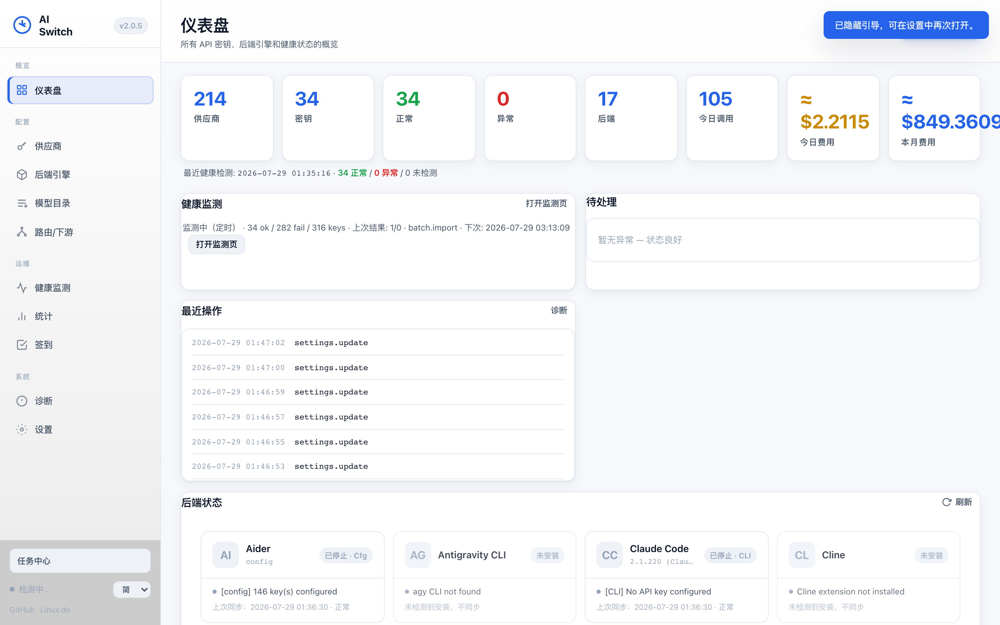
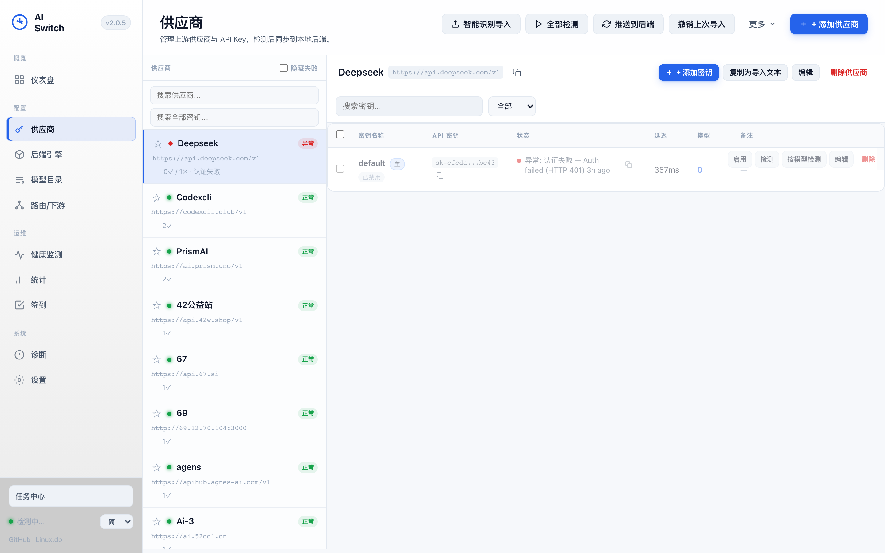
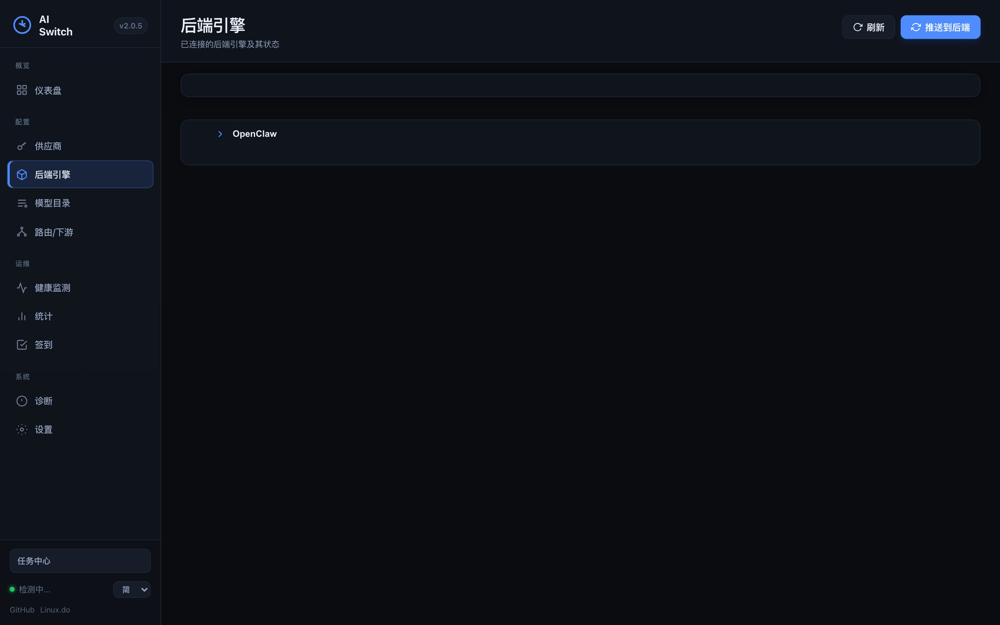
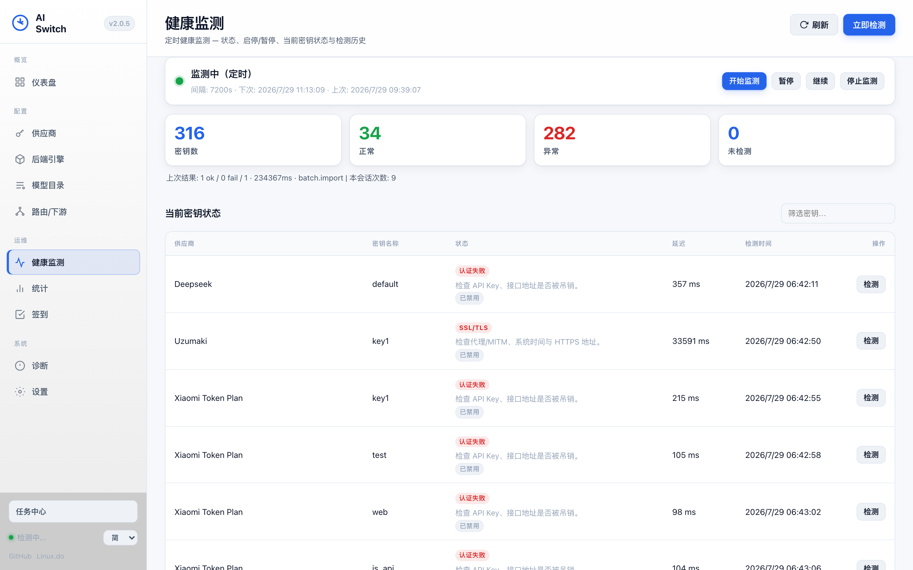
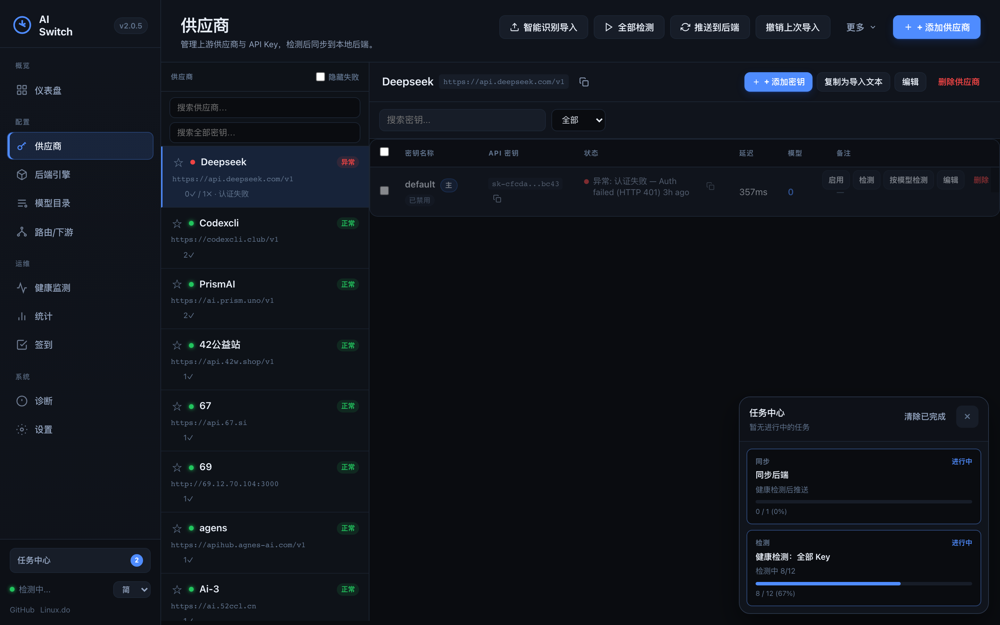
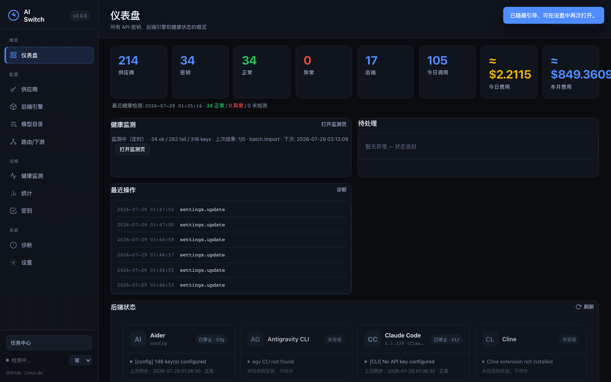

<p align="center">
  <a href="README-zh_CN.md">简体中文</a> ·
  <a href="README-zh_TW.md">繁體中文</a> ·
  <a href="README.md">English</a>
</p>

<h1 align="center">AI Switch</h1>

<p align="center">
  <strong>本地 AI Key 中樞 — 一把 Key 改完，多工具立刻能用</strong>
</p>

<p align="center">
  <a href="https://github.com/kingkate2009-droid/ai-switch/releases"></a>
  <a href="https://github.com/kingkate2009-droid/ai-switch/stargazers"></a>
  <a href="LICENSE"></a>
</p>

---

## 為什麼需要

中轉站 / 多供應商 Key 一多，OpenClaw、OpenCode、Codex、Claude Code 設定就容易亂：

| 痛點 | 自己改設定 | 用 AI Switch |
|------|------------|--------------|
| 換一把 Key | 改 5 個檔案 | 改一處 → 推到已安裝工具 |
| 壞 Key | 工具掛掉 | 健康檢測 → 從後端踢掉 |
| 寫錯設定 | 靜默覆蓋 | **推送前 Preview** · 未安裝不寫 |

**定位：** 本地 **Key 中樞**（管 Key、驗健康、推設定），不是又一個聊天客戶端。

> 一把 Key 改完，多工具立刻能用；壞 Key 別把工具搞掛。

## 介面預覽

<p align="center">
  
</p>

<p align="center">
  
  &nbsp;
  
</p>

<p align="center">
  
  &nbsp;
  
</p>

<p align="center">
  
</p>

## 三分鐘上手

**建議：** 從 [Releases](https://github.com/kingkate2009-droid/ai-switch/releases) 下載對應平台包 → 解壓執行 → **http://127.0.0.1:8787**

```bash
git clone https://github.com/kingkate2009-droid/ai-switch.git
cd ai-switch
pip install -r requirements.txt
python3 run.py
```

圖文：[docs/quickstart.md](docs/quickstart.md) · Codex：[docs/troubleshoot-codex.md](docs/troubleshoot-codex.md)

## 它解決什麼

1. **Key 集中管** — 匯入、去重、標籤  
2. **知道誰還能用** — 健康檢測、可讀錯誤  
3. **同步別寫錯** — Preview、未安裝零寫入  

完整說明見 [簡體 README](README-zh_CN.md) / [English](README.md)。

## 相容後端

OpenClaw · OpenCode · Claude Code · Codex CLI · Cline · Aider · Continue.dev · Hermes · QwenCode · Kimi Code · TRAE Work  
詳見 [docs/backends.md](docs/backends.md)。

## 設定與安全

資料在 `~/.ai-switch/`，**不要提交進 Git**。埠 `8787`。

## 連結

- [Releases](https://github.com/kingkate2009-droid/ai-switch/releases)  
- [Issues](https://github.com/kingkate2009-droid/ai-switch/issues)  
- [Linux.do](https://linux.do/)  

## 開源協議

Apache 2.0
